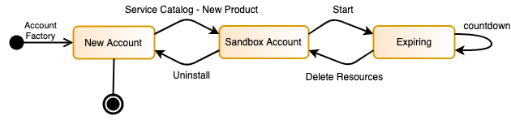
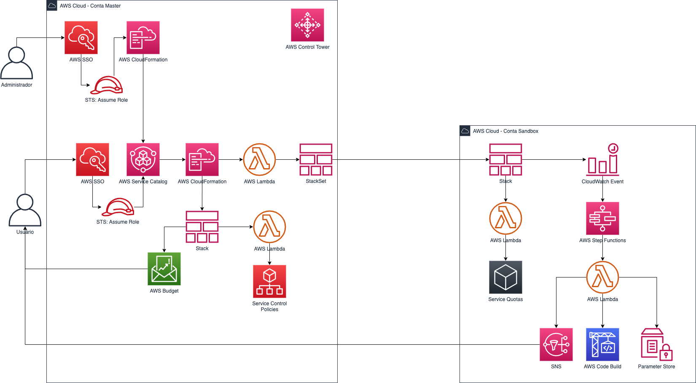

# Sandbox Account - Serverless solution for ephemeral resources

Em [Português](README_pt_BR.md)

This is a project for enable aws accounts to sandbox creating a lifecycle of resources that will be delete when the countdown reach out the last day.

# Architecture

This project includes the AWS CloudFormation scripts to create, configure, build and deploy a Service Catalog product.

From this product you can deploy this architecture:

## Quick links

1. [Installation](#Installation)
2. [Using the Solution](#Using-the-solution)
2. [Deploy the Solution](#Deploy-the-solution)
3. [Troubleshoot](#Troubleshoot)
4. [Cleanup](#Cleanup)

## Installation

You can have your sandbox account deployed and running in three automatic steps:
Note: Total time for this setup is around 2-3 minutes. 
Cost of this solution is around US$ 5.60 per account/month (us-east-1 / North Virginia). **You need a region where service CodeBuild is running**

### Deploy the Solution 
  
|Deploy | Region |
|:---:|:---:|
|[][us-east-1-account-sandbox] | US East (N. Virginia)|
|[][sa-east-1-account-sandbox] | SA East (São Paulo)|

After deploy the solution, a service catalog will be created and from there you can deploy a solution.
The Service Catalog will have a product call "Sandbox Account", you can launch it and fullfil the parameters required:

|Parameter | Description |
|:---:|:---:|
|Email address | This will be the email address that will receive all the notifications about the lifecycle of this account|
|Budget Name| Budget name for this account that will be available in your organization's master account |
|Budget Amount| Mount in dollars that this account is budgeted for, if it reaches over 90% of the stipulated amount, the email registered in the above parameter will receive an alert notification, as in the image below|
|vCPU EC2| This parameter if you want the already open a ticket to get more vCPU. Generally a new account get only 5 vCPU|
|AWS Account ID| Experimentation Account ID. Note: AWS account has 12 digits, without quotes and without spaces|
|AWS Region| Region where the resources that monitor the account will be deployed, available to N. Virginia and São Paulo|
|Amount days lifecycle| This is the number of days that the account's resources existed before being deleted. This parameter is automatically reduced every day.|
## Using the Solution

## Troubleshoot

## Cleanup

[us-east-1-account-sandbox]: https://console.aws.amazon.com/cloudformation/home?region=us-east-1#/stacks/new?stackName=CreateSC-Sandbox&templateURL=https://masterbuilder-account-sandbox.s3.amazonaws.com/sandbox-service-catalog.yaml
[sa-east-1-account-sandbox]: https://console.aws.amazon.com/cloudformation/home?region=sa-east-1#/stacks/new?stackName=CreateSC-Sandbox&templateURL=https://masterbuilder-account-sandbox.s3.amazonaws.com/sandbox-service-catalog.yaml
